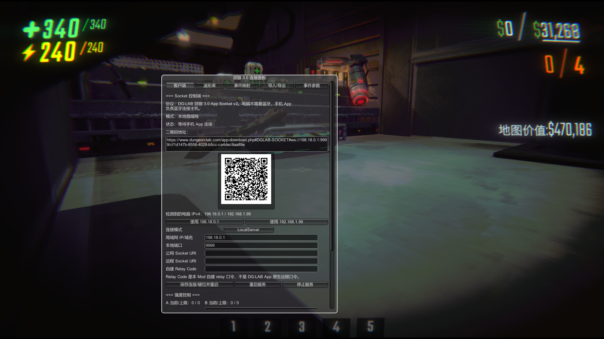

# DGLabPunish v0.6.0

DGLabPunish is a R.E.P.O. BepInEx mod for connecting a DG-LAB Coyote 3.0 device in game. It supports hit and death punishment, continuous waveforms, left/right footstep effects, sprinting, jumping, landing, sliding, strength controls, and an in-game App Socket control panel.

Author: **AngelcoMilk**  
GitHub Repository: https://github.com/AngelcoMilk/DGLabPunish  
Thunderstore: https://thunderstore.io/c/repo/p/AngelcoMilk/DGLabPunish/

DGLabPunish starts a DG-LAB App Socket controller inside R.E.P.O. Your phone scans the QR code in the in-game panel, then the phone connects to the Coyote 3.0 device over Bluetooth. Your PC does not need Bluetooth.

```text
R.E.P.O. Mod -> WebSocket -> DG-LAB 3.0 phone app -> phone Bluetooth -> Coyote 3.0 device
```

## Required App Version

- Use the `DG-LAB 3.0+` Android app from Google Play. The 3.x app line is recommended.
- `DG-LAB 4.0` and later are currently not compatible with this Socket workflow.
- The phone handles Bluetooth. The PC only needs network access from the phone.

## In-Game Panel

Press `P` to open the Coyote 3.0 connection panel.



Panel notes:

1. **Tabs**: `Client` handles connection and strength control. `Wave Library`, `Event Mapping`, `Import/Export`, and `Event Parameters` are used for waveform and punishment tuning.
2. **Socket status**: shows protocol, connection mode, and phone app connection state.
3. **QR text**: the exact Socket URL encoded in the QR code. Scan it with the DG-LAB 3.0+ app Socket feature, not a normal camera scanner.
4. **QR code**: the phone connects to the WebSocket address shown in the panel.
5. **Detected IPv4 addresses**: choose an address reachable from the phone. Home networks usually use `192.168.x.x`.
6. **Connection mode**: `LocalServer` means the PC listens locally and the phone connects over LAN.
7. **LAN IP/domain and local port**: these values are used in the QR code. The default port is `9999`.
8. **Public/remote/relay fields**: for public Socket URLs, custom remote Socket URLs, or custom relay codes. The relay code is not the native DG-LAB app remote-control code.
9. **Save/restart/stop**: after changing IP, port, or remote address, save and restart the service, then scan again.
10. **Strength control**: shows A/B channel strength and limits, with test and clear controls.

## Choosing An IP Address

1. Prefer the IPv4 address on the same Wi-Fi/LAN as the phone.
2. Common usable ranges are `192.168.x.x`, `10.x.x.x`, and `172.16.x.x - 172.31.x.x`.
3. Do not use `127.0.0.1`; the phone cannot reach the PC through that address.
4. `198.18.x.x` often belongs to virtual adapters, proxies, or testing networks. If scanning fails, switch to the real LAN address.
5. After changing the IP or port, save, restart the service, and scan the new QR code.
6. Make sure Windows Firewall allows R.E.P.O. or port `9999`.

## Main Features

- Hit and death punishment waveforms.
- Continuous walking, sprinting, and sliding waveforms.
- Left foot to A channel and right foot to B channel by default.
- Jump, landing, slide, and optional enemy footstep cues.
- A/B strength control, test waveforms, queue clearing, and connection diagnostics.
- Wave presets plus profile import/export.

## Hotkeys

- `P`: open or close the in-game control panel.
- `I`: emergency stop. Clears A/B queues and sets strength to 0.

## Installation With r2modman

1. Import the zip package.
2. Confirm the DLL path is `BepInEx/plugins/DGLabPunish/DGLabPunish.dll`.
3. Make sure `BepInExPack` is installed.

## Known Limits

- Only supports DG-LAB Coyote 3.0 App Socket control. It does not directly control PC Bluetooth.
- `DG-LAB 4.0` and later are currently incompatible with this Socket workflow.
- If the phone and PC are not on the same LAN, the LAN QR code will not work. Use a public Socket address or your own relay instead.
- Events trigger only on the local client. The mod does not modify R.E.P.O. network state or force effects onto other players.
- Avoid testing strong or unfinished profiles in public lobbies.
